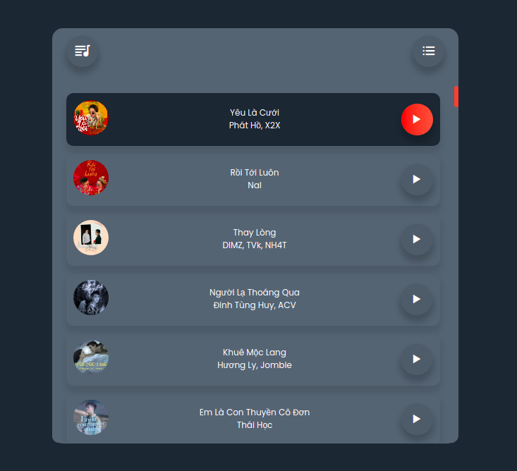
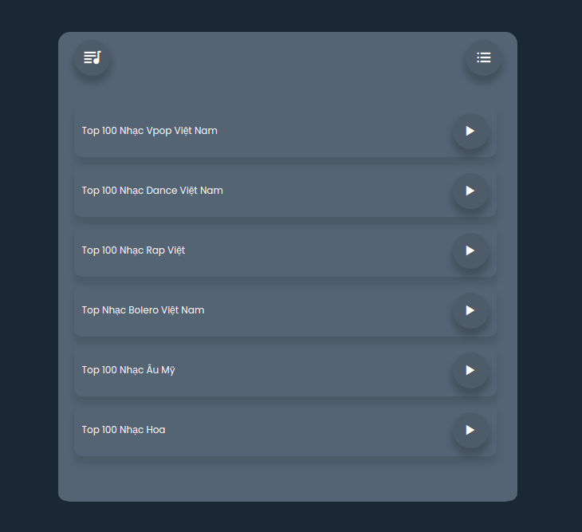

## Get link zing mp3 nct url

### Big thank to phamhiep2506 and https://github.com/whoant/nhaccuatui-api

### fork from https://github.com/phamhiep2506/music-player

`Hiện tại chỉ get nhạc việt, nhạc quốc tế sẽ ko get được, trừ khi dùng vps host vn, đang cần cao nhân chỉ cách làm`

- Get from link support song and album
  + https://api-zingmp3-nct.vercel.app/api/link?id={url}
  > https://api-zingmp3-nct.vercel.app/api/link?id=https://zingmp3.vn/album/La-Con-Gai-Phai-Xinh-Single-Bao-Thy-Kimmese/ZOZ7I06Z.html
  > https://api-zingmp3-nct.vercel.app/api/link?id=https://www.nhaccuatui.com/bai-hat/nguoi-em-co-do-rum-ft-daa.l6TIwWBOHPwd.html
  return title, link mp3, thumbnail, id

- Get from link support song and album and redirect mp3 link
  + https://api-zingmp3-nct.vercel.app/api/linkRedirect?id={url}
  > https://api-zingmp3-nct.vercel.app/api/linkRedirect?id=https://zingmp3.vn/album/La-Con-Gai-Phai-Xinh-Single-Bao-Thy-Kimmese/ZOZ7I06Z.html
  > https://api-zingmp3-nct.vercel.app/api/linkRedirect?id=https://www.nhaccuatui.com/bai-hat/nguoi-em-co-do-rum-ft-daa.l6TIwWBOHPwd.html
  return title link mp3 file


- Get Song url direct and redirect (new):
  + https://api-zingmp3-nct.vercel.app/api/songUrl?id={param-id-song}
  > https://api-zingmp3-nct.vercel.app/api/songUrl?id=ZUUUEEIE
 return ex:
 `https://vnso-zn-23-tf-mp3-s1-zmp3.zadn.vn/956cefbc94f87da624e9/2766204956296265927?authen=exp=1639716009~acl=/956cefbc94f87da624e9/*~hmac=e58801252685398cd353c2016765930e&fs=MTYzOTU0MzIwOTY4N3x3ZWJWNnwwfDE0LjE4OC40Mi4xNA`

## Get link NCT WIP


API from author
- Get Song:
  + https://api-zingmp3-nct.vercel.app/api/song?id={param-id-song}
  > https://api-zingmp3-nct.vercel.app/api/song?id=ZUUUEEIE


- Get Playlist:
  + https://api-zingmp3-nct.vercel.app/api/playlist?id={param-id-playlist}
  > https://api-zingmp3-nct.vercel.app/api/playlist?id=ZWZB969E

- Get Top 100:
  + https://api-zingmp3-nct.vercel.app/api/top100
  > https://api-zingmp3-nct.vercel.app/api/top100

- Get Charthome:
  + https://api-zingmp3-nct.vercel.app/api/chart-home
  > https://api-zingmp3-nct.vercel.app/api/chart-home

- Get Info Song:
  + https://api-zingmp3-nct.vercel.app/api/info?id={param-id-song}
  > https://api-zingmp3-nct.vercel.app/api/info?id=ZUUUEEIE

### Install Package

```bash
$ yarn install
```
or
```bash
$ npm install
```

### Run App

```bash
$ yarn start
```
or
```bash
$ npm run start
```
### Screenshot




